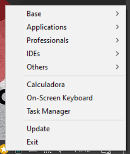

# Favorite Apps Tray For Windows

- This repository contains app to add an menu with favorites apps on system tray

## Configurations

### Windows
- All **Shurtcuts** , its on:
  - On windows menu
    - `C:\Users\YOUR_USER_NAME\AppData\Roaming\Microsoft\Windows\Start Menu\Programs`
    - `C:\\ProgramData\\Microsoft\\Windows\\Start Menu\\Programs`
  - Custom **Shurtcuts**, on `item` put the path of the **Shurtcuts** and pass `isCustom` as `true`.
- Contents of `favorites-apps-indicator.json` on your home directory

```json
{
    "SORT": true, // Sort ascending by item name
    "NO_MENU": [
		{ "item": "Task Manager.lnk", "type": "item" },
		{ "item": "C:\\Shurtcuts\\Calculadora.lnk", "description": "Create shurtcuts on C:\\Shurtcuts. Drag and drop shurtcuts on menu", "type": "custom-item" },
		{ "item": "On-Screen Keyboard.lnk", "type": "item" }
    ],
    "OTHERS": {
        "Base": [
			{ "item": "7-Zip File Manager.lnk", "type": "item" }
            
        ],
		"Applications": [
			{ "item": "LibreOffice.lnk", "type": "item" },            
        ],
        "Professionals": [
			{ "item": "Rancher Desktop.lnk", "type": "item" },
			{ "name": "Portainer", "item": "start cmd /c \"portainer-manager-cli.cmd\"", "type": "command", "shell": "cmd" }
        ],
		"IDEs": [
			{ "item": "DBeaver.lnk", "type": "item" },
			{ "item": "Visual Studio Code.lnk", "type": "item" },
        ]
    }
}
```
Example:



**NOTE**
- If **Shurtcuts** not exist, the content not appear